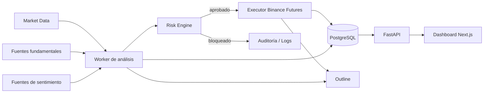

# Arquitectura general

```mermaid
flowchart LR
    MD[Market Data] --> W[Worker de análisis]
    FD[Fuentes fundamentales] --> W
    SD[Fuentes de sentimiento] --> W
    W --> RE[Risk Engine]
    RE -->|aprobado| EX[Executor Binance Futures]
    RE -->|bloqueado| LOG[Auditoría / Logs]
    EX --> DB[(PostgreSQL)]
    W --> DB
    EX --> OL[Outline]
    W --> OL
    DB --> API[FastAPI]
    API --> WEB[Dashboard Next.js]
```
