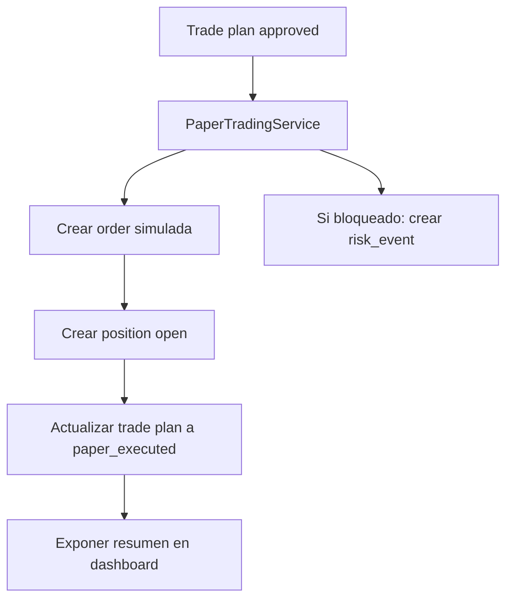

# Flujo de paper trading

```mermaid
flowchart TD
    A[Trade plan approved] --> B[PaperTradingService]
    B --> C[Crear order simulada]
    C --> D[Crear position open]
    D --> E[Actualizar trade plan a paper_executed]
    E --> F[Exponer resumen en dashboard]
    B --> G[Si bloqueado: crear risk_event]
```
