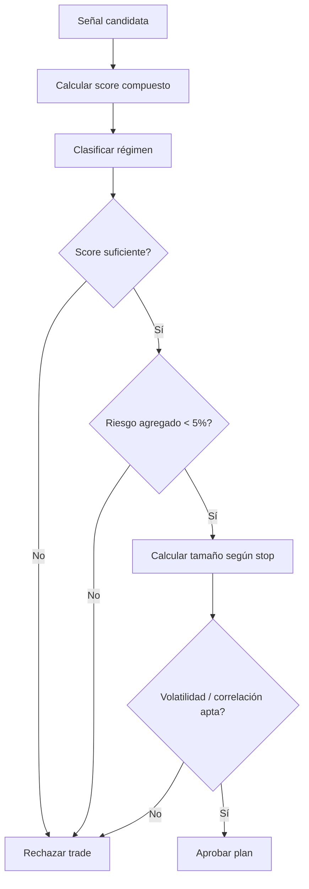

# Flujo de validación de riesgo

```mermaid
flowchart TD
    A[Señal candidata] --> B[Calcular score compuesto]
    B --> C[Clasificar régimen]
    C --> D{Score suficiente?}
    D -- No --> X[Rechazar trade]
    D -- Sí --> E{Riesgo agregado < 5%?}
    E -- No --> X
    E -- Sí --> F[Calcular tamaño según stop]
    F --> G{Volatilidad / correlación apta?}
    G -- No --> X
    G -- Sí --> H[Aprobar plan]
```
