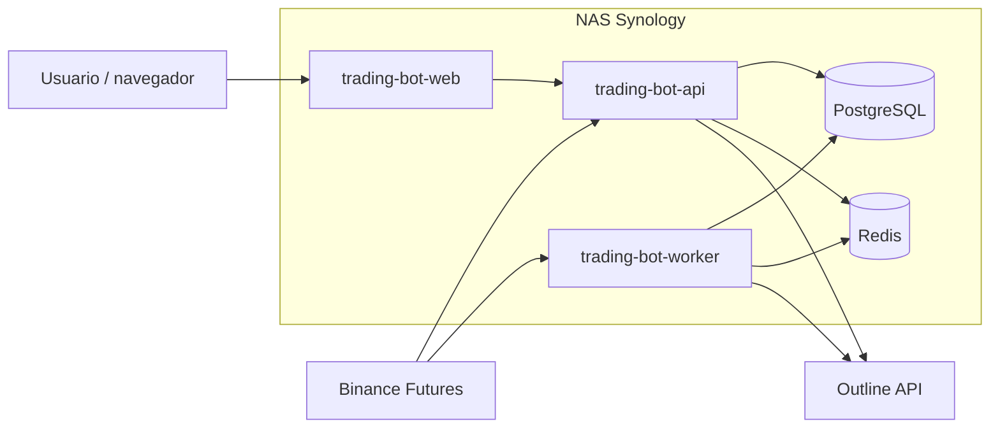

# Topología Synology-first

```mermaid
flowchart LR
    BR[Binance Futures] --> API[trading-bot-api]
    BR --> W[trading-bot-worker]
    W --> PG[(PostgreSQL)]
    API --> PG
    W --> R[(Redis)]
    API --> R
    API --> OL[Outline API]
    W --> OL
    UI[Usuario / navegador] --> WEB[trading-bot-web]
    WEB --> API
    subgraph NAS Synology
      PG
      R
      API
      W
      WEB
    end
```
