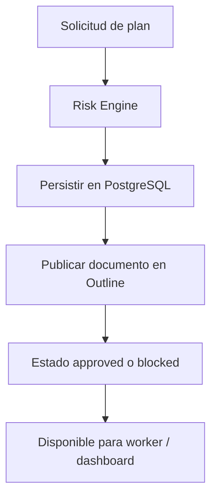

# Ciclo de vida de un trade plan

```mermaid
flowchart TD
    A[Solicitud de plan] --> B[Risk Engine]
    B --> C[Persistir en PostgreSQL]
    C --> D[Publicar documento en Outline]
    D --> E[Estado approved o blocked]
    E --> F[Disponible para worker / dashboard]
```
